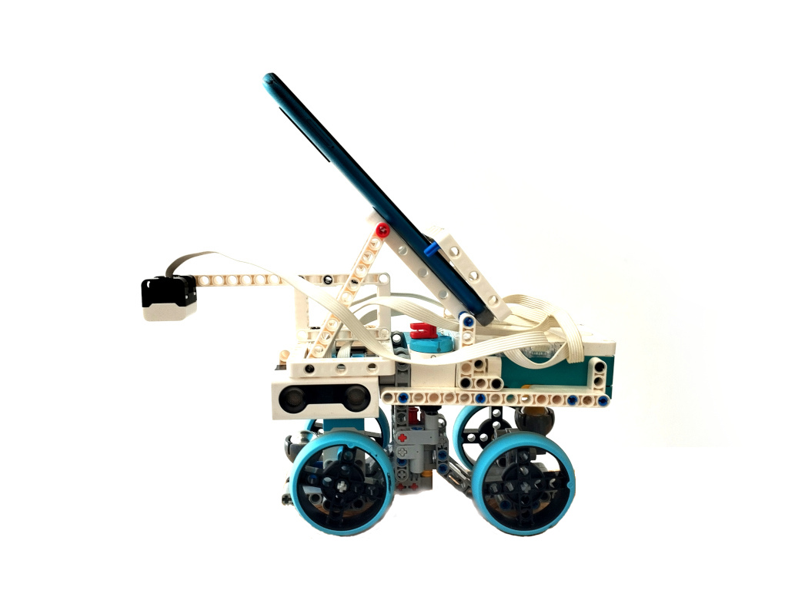
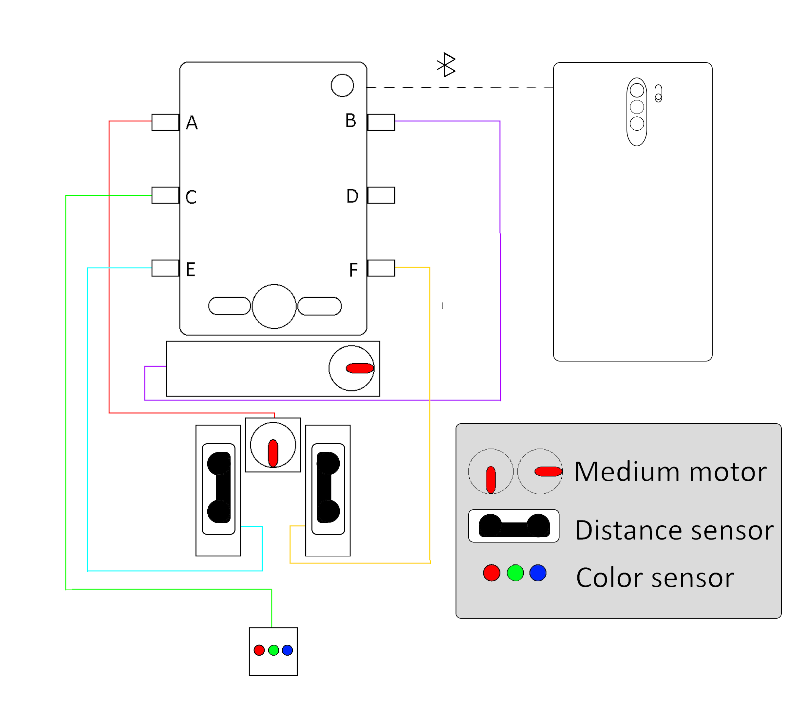

# 1. Prototype

1. **Considerations**  
      - High manoeuvrability  
      - Narrow width  
      - Easy variability of sensor placement  
      - We wanted to build the robot from the Spike kit  
      - Camera (unfortunately this was not available)

2. **Construction**  
      - Steering gear design with pivot, also known as waist articulation, agreed in advance by e-mail.  
      - Size: 290x100x150 cm  
      - Weight: 605g  
      - Components:  
        - The robot was built from the Lego Spike kit  
        - Lego Spike Brick  
        - Size of the 4 wheels: 56x16mm  
      - Sensors:  
        - 2 distance sensors  
        - 4 axis built-in gyroscope  
        - 1 colour sensor (motor driven by an arm design to identify obstacles to be avoided from above)  
      - Motors:  
        - 3 medium motors:  
          - To rotate the colour sensor  
          - To rotate the steering  
          - To move the robot
      - Camera phone:
            - connection to the hub via Bluetooth.
        

# 2. Programming

   ## a. Formulation of Subtasks
   1. **Straight motion:** Using the gyroscope, we solved the high precision straight motion using the P algorithm.
   
   2. **Turning:** Accurate 90° turns are important, so this was dealt with in a separate subtask, also in a separate block (procedure) in the program.
   
   3. **From the parking lot:** Before exiting the parking lot, distance sensors are used to determine the direction in which the robot will move, and the robot starts the next subroutine accordingly.
   
   4. **To parking:** The robot keeps a variable record of the lap it is currently on. After the third lap, it switches to parking mode. It searches for a parking space and performs a partial parking. A separate block (procedure) is created for this, and the turning of the parking spaces is also set in a separate procedure.
   
   5. **Free run task:** The procedures tested in the subtasks can be combined to solve the free run task.  
      - **Strategy 1:** Maximum speed, maintaining a minimum safe distance from the inner wall. This minimized the running time!  
      - **Test data:** Average task time: 1 minute 29 seconds.

 ## b. Obstacle Course
- **Obstacle Detection**
         - Obstacle detection is possible with distance sensors facing sideways.
         - The color of the obstacle is determined by means of a color sensor positioned above the sideways projecting obstacle.

- **Problem:** Obstacle detection has a high probability of success. Determining the color of obstacles is successful with low probability.

   ### Obstacle Avoidance
   A static sequence of movements can be used to avoid the obstacle and return to the ideal arc. One-on-one avoidance still has a high probability of success, but many avoidances accumulate errors and the whole task can get stuck. 
   
   Thus, we made the strategic decision to maximize points to ensure we finish and park, so we ignored the obstacles and did not touch them. By following the inner arc, we avoid half of the obstacles from the right direction.

## c. Obstacle Detection

A machine learning add-on is available for the LEGO MINDSTORMS Robot Inventor software, allowing users to integrate machine learning models into their robots. This add-on typically includes the following:

1. **Image Data Processing:** The add-on enables the use of the phone camera's image and utilizes this data for training machine learning models. It often includes predefined models that help users quickly start machine learning projects. These models typically address fundamental tasks such as image recognition or identifying movement patterns.

2. **Training:** We train four models (Right Red Obstacle, Left Red Obstacle, Right Green Obstacle, Left Green Obstacle). Eight to ten photos per model are sufficient.

3. **Usage:** When the robot is in front of the obstacle, it uses the machine learning add-on. It moves according to the most likely option provided by the four models.

