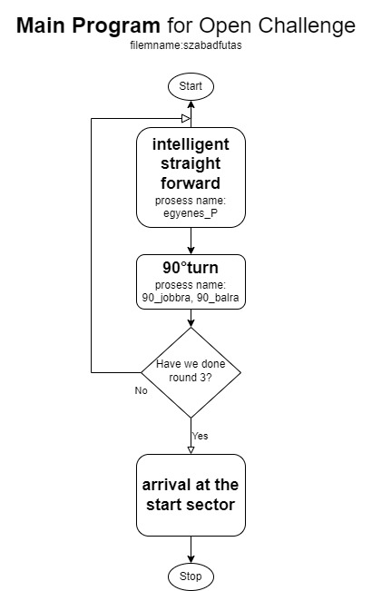
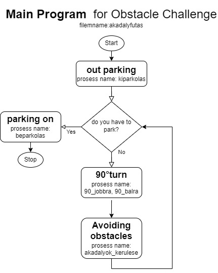
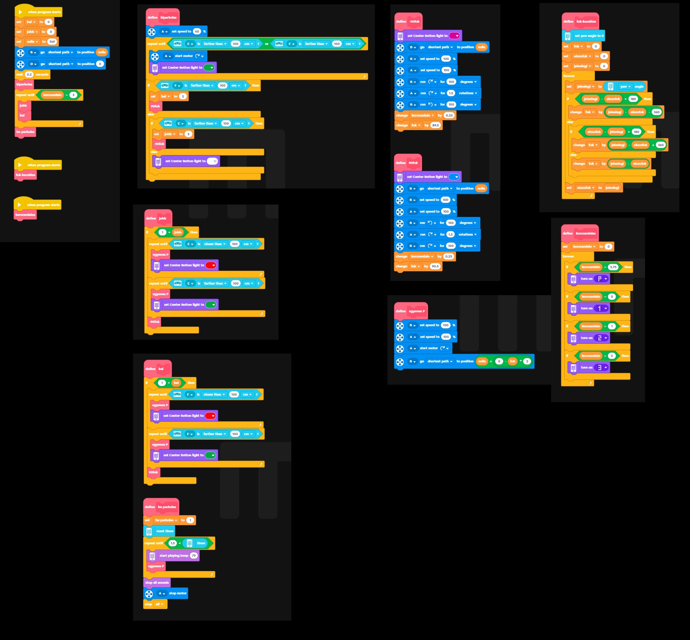
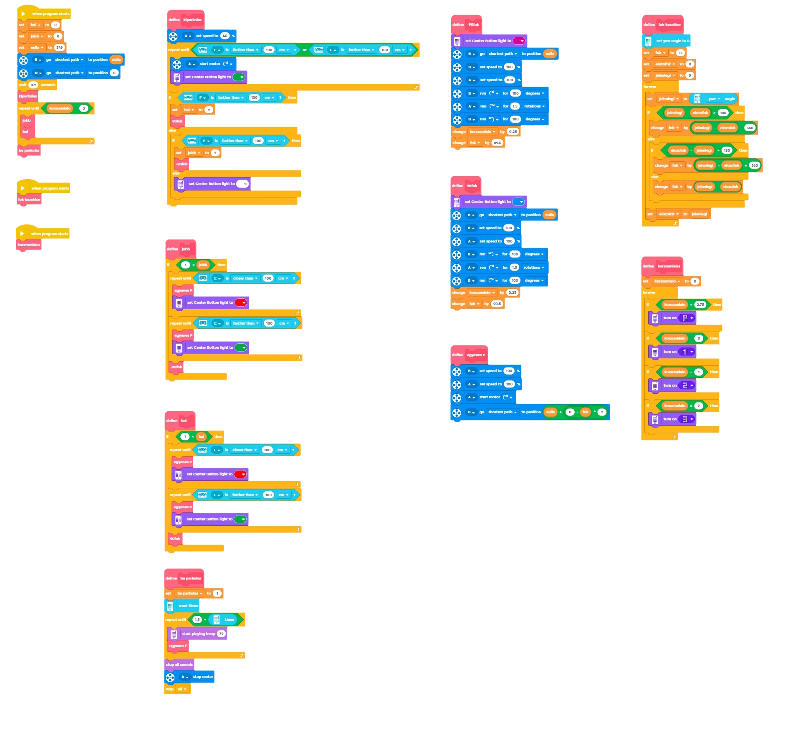

# 1. Programming

   ## a. Formulation of Subtasks
   1. **Straight motion:** Using the gyroscope, we solved the high precision straight motion using the P algorithm.
   
   2. **Turning:** Accurate 90° turns are important, so this was dealt with in a separate subtask, also in a separate block (procedure) in the program.
   
   3. **From the parking lot:** Before exiting the parking lot, distance sensors are used to determine the direction in which the robot will move, and the robot starts the next subroutine accordingly.
   
   4. **To parking:** The robot keeps a variable record of the lap it is currently on. After the third lap, it switches to parking mode. It searches for a parking space and performs a partial parking. A separate block (procedure) is created for this, and the turning of the parking spaces is also set in a separate procedure.
   
   5. **Free run task:** The procedures tested in the subtasks can be combined to solve the free run task.  
      - **Strategy 1:** Maximum speed, maintaining a minimum safe distance from the inner wall. This minimized the running time!  
      - **Test data:** Average task time: 1 minute 29 seconds.

## b. Obstacle Detection

A machine learning add-on is available for the LEGO MINDSTORMS Robot Inventor software, allowing users to integrate machine learning models into their robots. This add-on typically includes the following:
. Eight to ten photos per model are sufficient.

3. **Usage:** When the robot is in front of the obstacle, it uses the machine learning add-on. It moves according to the most likely option provided by the four models.
   

# 2. Block code

