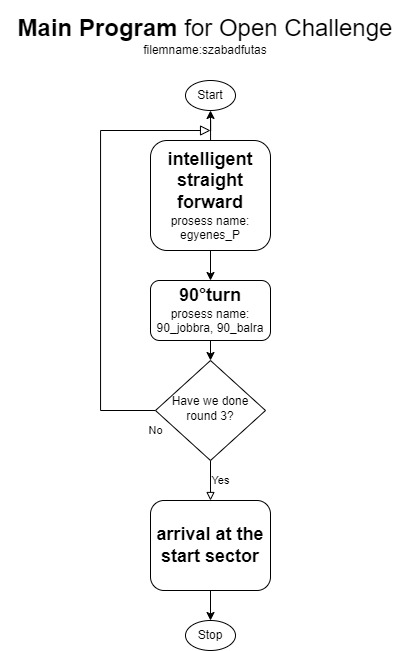
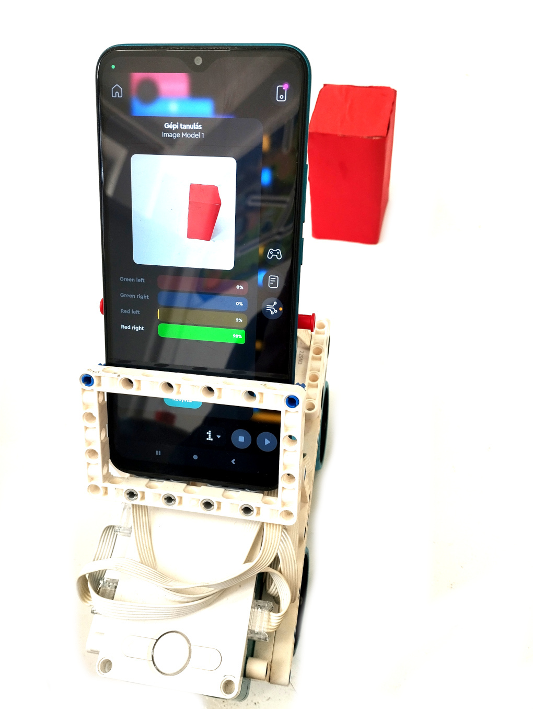
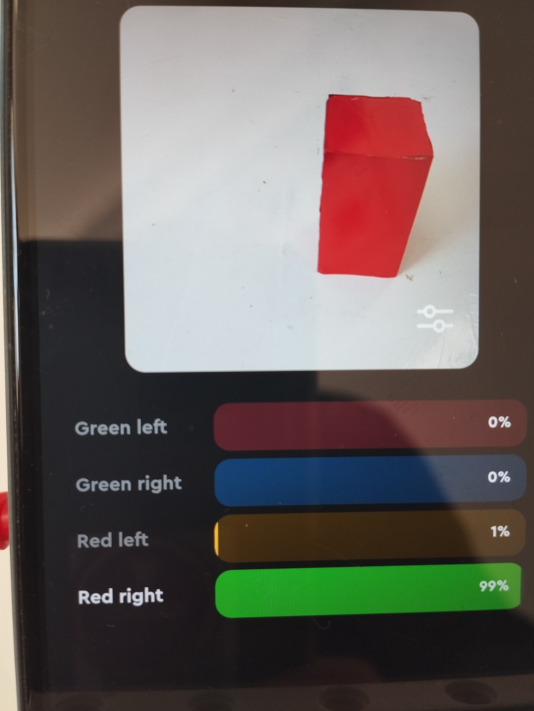
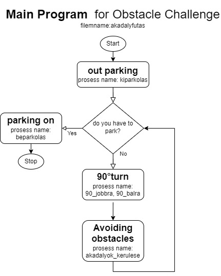
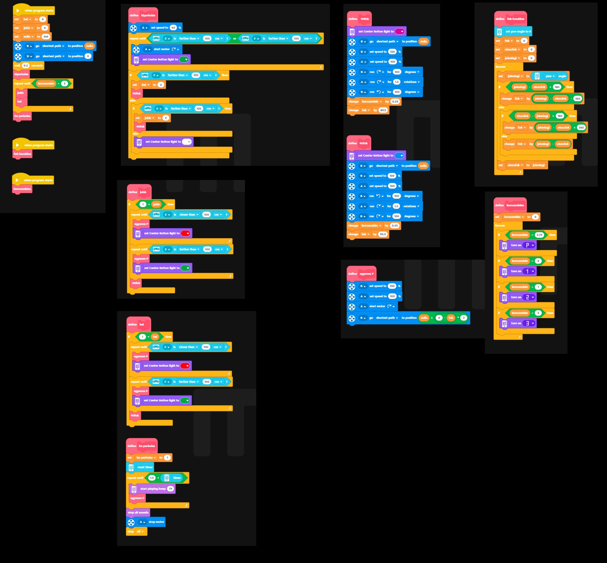
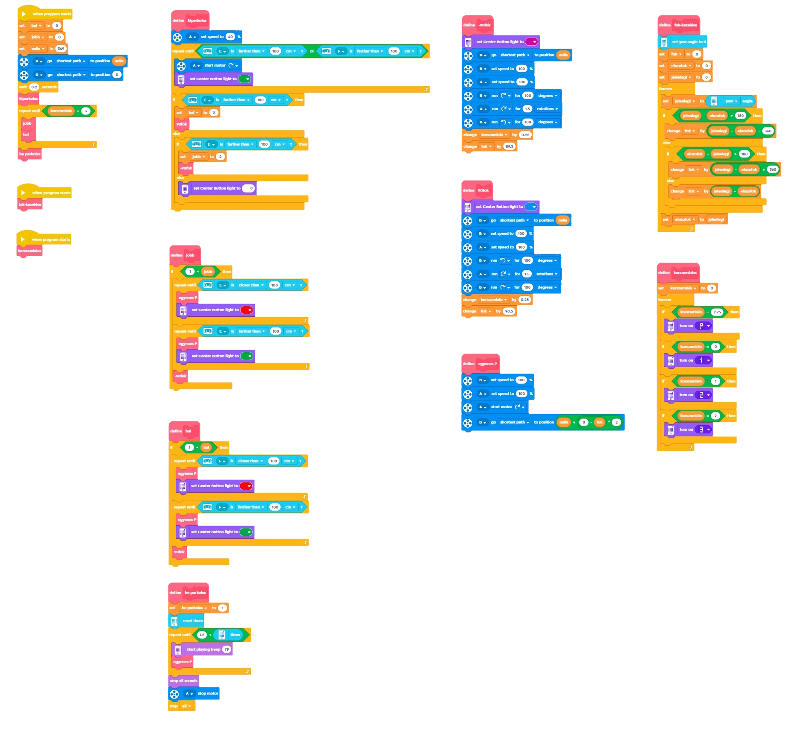
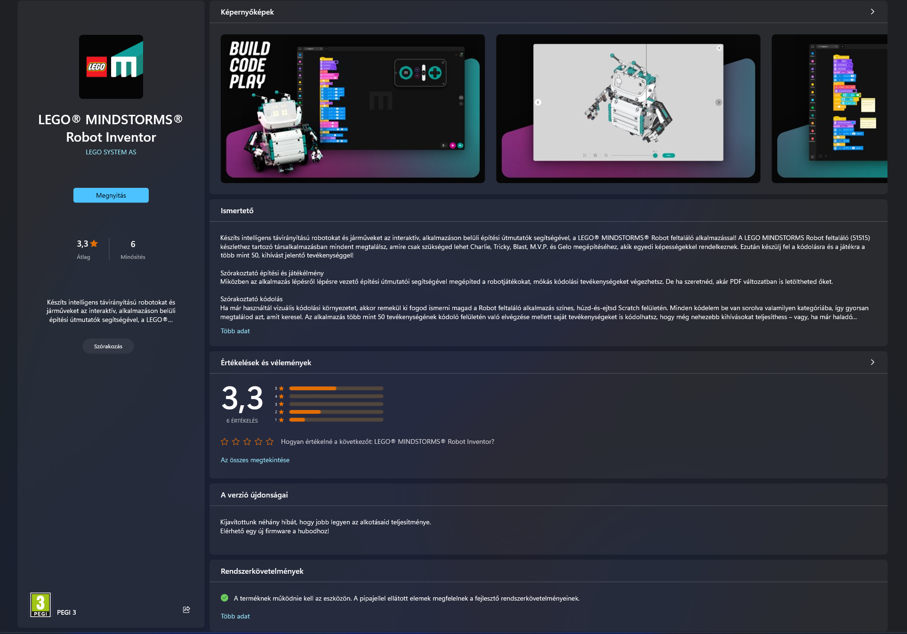
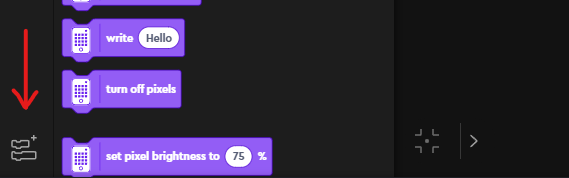
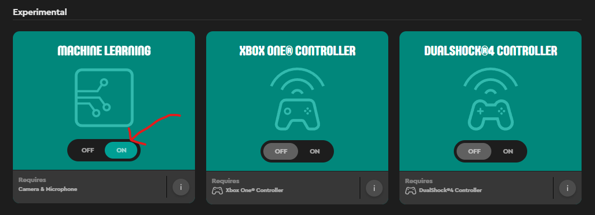

# 1. Programming

   ## a. Formulation of Subtasks
   1. **Straight motion:** Using the gyroscope, we solved the high precision straight motion using the P algorithm.
   
   2. **Turning:** Accurate 90° turns are important, so this was dealt with in a separate subtask, also in a separate block (procedure) in the program.
   
   3. **From the parking lot:** Before exiting the parking lot, distance sensors are used to determine the direction in which the robot will move, and the robot starts the next subroutine accordingly.
   
   4. **To parking:** The robot keeps a variable record of the lap it is currently on. After the third lap, it switches to parking mode. It searches for a parking space and performs a partial parking. A separate block (procedure) is created for this, and the turning of the parking spaces is also set in a separate procedure.
   
   5. **Free run task:** The procedures tested in the subtasks can be combined to solve the free run task.  
      - **Strategy 1:** Maximum speed, maintaining a minimum safe distance from the inner wall. This minimized the running time!  
      - **Test data:** Average task time: 0 minute 55 seconds.

# Main flowchart for Open challange

## b. Obstacle Detection

A machine learning add-on is available for the LEGO MINDSTORMS Robot Inventor software, allowing users to integrate machine learning models into their robots. This add-on typically includes the following:

1. **Image Data Processing:** The add-on enables the use of the phone camera's image and utilizes this data for training machine learning models. It often includes predefined models that help users quickly start machine learning projects. These models typically address fundamental tasks such as image recognition or identifying movement patterns.

2. **Training:** We train four models (Right Red Obstacle, Left Red Obstacle, Right Green Obstacle, Left Green Obstacle). Eight to ten photos per model are sufficient.

3. **Usage:** When the robot is in front of the obstacle, it uses the machine learning add-on. It moves according to the most likely option provided by the four models.

# Main flowchart for Obstacle challange

# 2. Block code

# Hardware:
This project can be done with a laptop or a computer running windows 10 or newer if you can connect the hub with a data 
cable or bluetooth to the computer/laptop, a mobile phone that support the mindstorms app and have the necessary softwares

# Softwares for programming the Spike hub:

We first used the Lego Spike desktop application which can be downloaded from the Lego Educations website 

And we used an online editor that can be opened in a browser that supports connecting to the hub (we used Google Chrome)

We could not complete the obstacle challange with the Spike because we did not had a camera so we only focused on the open challange and make it
as good as possible.

# Software for programming the Mindstorms hub:

We used the official Mindstorms app(we downloaded it from microsoft store)

Fortunately we did not needed any downloadable extensions because the mindorms app supports machine learning and we used that
to indentify any obstacle (you can apply it when you open block extensions in the bottom left corner and in the experimental 
section enable machine learning)

For this we used a mobile phone that supported the Lego Mindstorms app uploaded the code 
to the phone and we trained the AI to indentify the obstacles and which side is it at(left or right)

# The open challange with comments:

# The obstacle challange with comments

