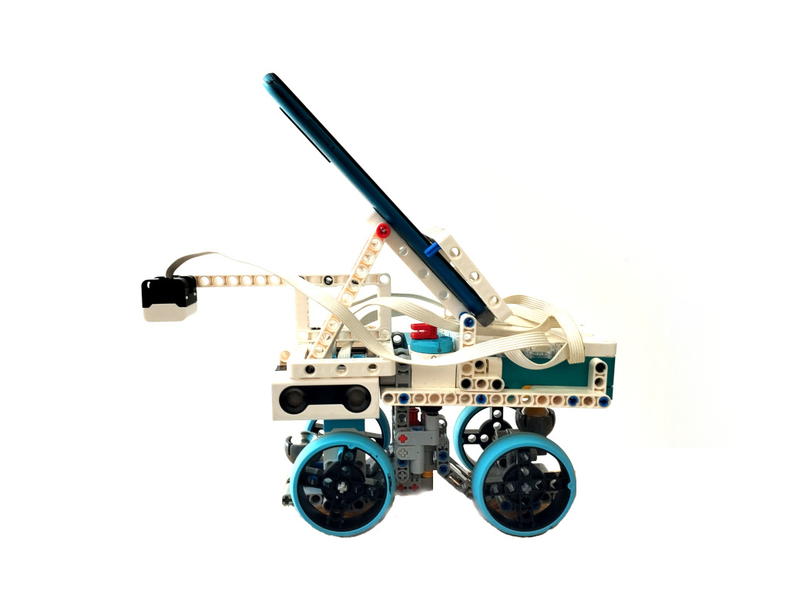
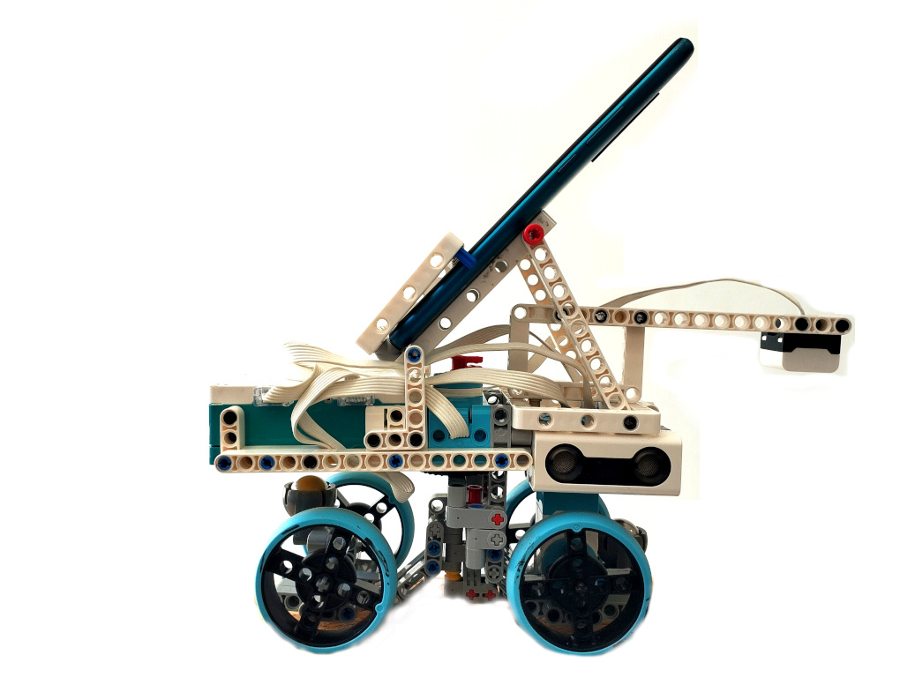
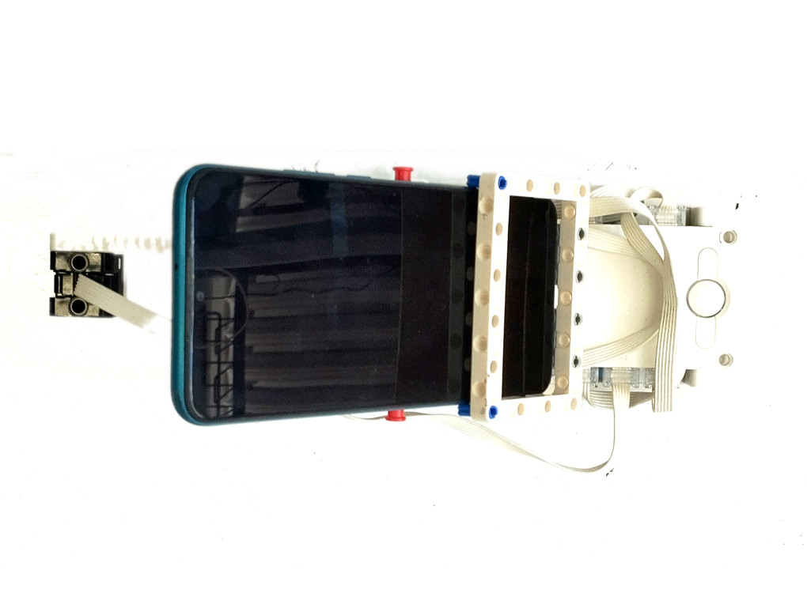

# Our Robot Project

Here is a complete view of our robot from all six sides.

  
  
  
  

  
  
  
  

  
  
  
  

We designed this robot to perform various tasks, and the images show it from every angle to provide a complete overview of its structure.
